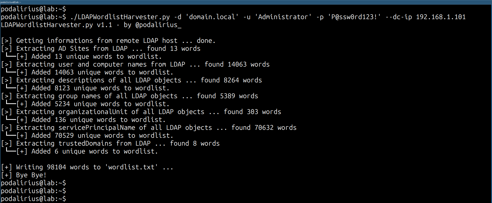

<p align="center">
    A tool to generate a wordlist from the information present in LDAP, in order to crack passwords of domain accounts.
    <br>
    
    <a href="https://twitter.com/intent/follow?screen_name=podalirius_" title="Follow"></a>
    <a href="https://www.youtube.com/c/Podalirius_?sub_confirmation=1" title="Subscribe"></a>
    <br>
</p>

## Features

 - [x] Creates a wordlist based on the following information found in the LDAP:
   - [x] **User**: `name` and `sAMAccountName`
   - [x] **Computer**: `name` and `sAMAccountName`
   - [x] **Groups**: `name`
   - [x] **Organizational Units**: `name`
   - [x] **Active Directory Sites**: `name` and `descriptions`
   - [x] **All LDAP objects**: `descriptions`
 - [x] Choose wordlist output file name with option `--outputfile`

---

## Demonstration

To generate a wordlist from the LDAP of the domain `domain.local` you can use this command:

```
./LDAPWordlistHarvester.py -d 'domain.local' -u 'Administrator' -p 'P@ssw0rd123!' --dc-ip 192.168.1.101
```

You will get the following output:



---

## Usage

```
$ ./LDAPWordlistHarvester.py -h
LDAPWordlistHarvester.py v1.1 - by @podalirius_

usage: LDAPWordlistHarvester.py [-h] [-v] [-o OUTPUTFILE] --dc-ip ip address [-d DOMAIN] [-u USER] [--no-pass | -p PASSWORD | -H [LMHASH:]NTHASH | --aes-key hex key] [-k]

options:
  -h, --help            show this help message and exit
  -v, --verbose         Verbose mode. (default: False)
  -o OUTPUTFILE, --outputfile OUTPUTFILE
                        Path to output file of wordlist.

Authentication & connection:
  --dc-ip ip address    IP Address of the domain controller or KDC (Key Distribution Center) for Kerberos. If omitted it will use the domain part (FQDN) specified in the identity parameter
  -d DOMAIN, --domain DOMAIN
                        (FQDN) domain to authenticate to
  -u USER, --user USER  user to authenticate with

Credentials:
  --no-pass             Don't ask for password (useful for -k)
  -p PASSWORD, --password PASSWORD
                        Password to authenticate with
  -H [LMHASH:]NTHASH, --hashes [LMHASH:]NTHASH
                        NT/LM hashes, format is LMhash:NThash
  --aes-key hex key     AES key to use for Kerberos Authentication (128 or 256 bits)
  -k, --kerberos        Use Kerberos authentication. Grabs credentials from .ccache file (KRB5CCNAME) based on target parameters. If valid credentials cannot be found, it will use the ones specified in the command line
```
